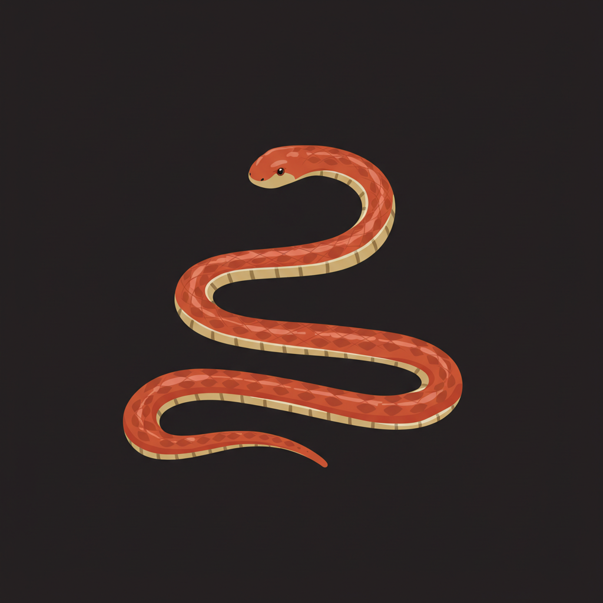

# 霓虹贪吃蛇游戏

[English](README_EN.md) | 中文

一个使用Flutter开发的现代化贪吃蛇游戏，具有炫酷的霓虹灯效果和流畅的游戏体验。



## 游戏特点

- **霓虹风格UI**：游戏采用现代霓虹灯风格设计，具有动态光效和颜色渐变
- **流畅动画**：食物脉冲动画、分数变化动画等增强游戏体验
- **音效系统**：吃到食物时播放音效，提升游戏反馈
- **动态难度**：随着分数增加，游戏速度逐渐加快，挑战性增强
- **多彩蛇身**：蛇的身体颜色会随着分数变化而改变，视觉效果丰富
- **多种控制方式**：支持键盘方向键和屏幕按钮两种控制方式

## 技术实现

- 使用**Flutter**框架开发，支持跨平台部署
- 采用**Provider模式**进行状态管理
- 使用**AnimationController**实现流畅的游戏动画
- 集成**audioplayers**库实现游戏音效
- 采用面向对象设计，游戏逻辑与UI展示分离

## 安装与运行

### 前提条件

- 安装Flutter SDK (2.0或更高版本)
- 安装Dart SDK
- 安装Android Studio或VS Code

### 安装步骤

1. 克隆项目到本地
   ```
   git clone https://github.com/zym9863/snake.git
   ```

2. 进入项目目录
   ```
   cd snake
   ```

3. 获取依赖包
   ```
   flutter pub get
   ```

4. 运行应用
   ```
   flutter run
   ```

## 游戏操作

- **开始/暂停游戏**：点击屏幕中央的按钮
- **控制蛇的移动**：
  - 键盘：使用方向键(↑ ↓ ← →)控制
  - 触屏：使用屏幕底部的方向按钮控制
- **暂停/继续**：按空格键或点击暂停按钮

## 游戏规则

1. 控制蛇吃到食物可增加10分
2. 每得到50分，游戏速度会增加
3. 撞到墙壁或自己的身体会导致游戏结束
4. 蛇不能直接掉头（180度转弯）

## 项目结构

- `lib/models/` - 游戏核心逻辑和数据模型
- `lib/screens/` - 游戏界面UI实现
- `lib/theme/` - 游戏主题和样式定义
- `assets/` - 游戏资源（图片、音效等）

## 许可证

本项目采用MIT许可证 - 详情请查看LICENSE文件
