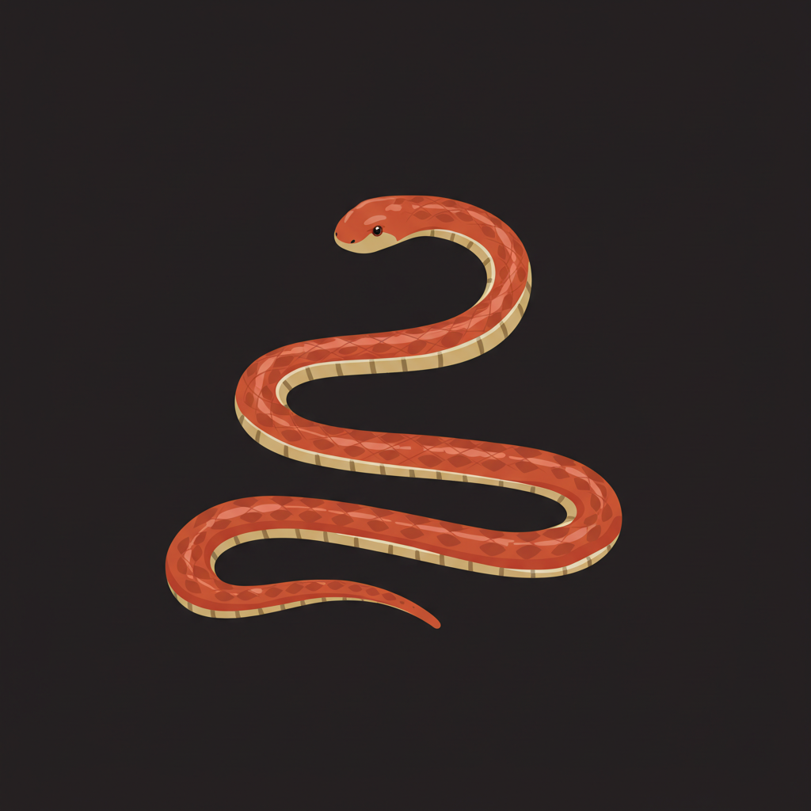

# Neon Snake Game

English | [中文](README.md)

A modern snake game developed with Flutter, featuring cool neon light effects and smooth gameplay experience.



## Game Features

- **Neon Style UI**: The game adopts a modern neon light style design with dynamic light effects and color gradients
- **Smooth Animations**: Food pulse animations, score change animations, etc. enhance the gaming experience
- **Sound System**: Sound effects when eating food, improving game feedback
- **Dynamic Difficulty**: As the score increases, the game speed gradually increases, enhancing the challenge
- **Colorful Snake Body**: The snake's body color changes with the score, enriching the visual effect
- **Multiple Control Methods**: Supports both keyboard arrow keys and on-screen buttons

## Technical Implementation

- Developed using the **Flutter** framework, supporting cross-platform deployment
- Uses the **Provider pattern** for state management
- Uses **AnimationController** to implement smooth game animations
- Integrates the **audioplayers** library for game sound effects
- Adopts object-oriented design, separating game logic from UI presentation

## Installation and Running

### Prerequisites

- Install Flutter SDK (version 2.0 or higher)
- Install Dart SDK
- Install Android Studio or VS Code

### Installation Steps

1. Clone the project locally
   ```
   git clone https://github.com/zym9863/snake.git
   ```

2. Enter the project directory
   ```
   cd snake
   ```

3. Get dependencies
   ```
   flutter pub get
   ```

4. Run the application
   ```
   flutter run
   ```

## Game Controls

- **Start/Pause Game**: Click the button in the center of the screen
- **Control Snake Movement**:
  - Keyboard: Use arrow keys (↑ ↓ ← →) to control
  - Touch screen: Use the direction buttons at the bottom of the screen
- **Pause/Resume**: Press the space bar or click the pause button

## Game Rules

1. Control the snake to eat food to increase score by 10 points
2. For every 50 points, the game speed will increase
3. Hitting the wall or your own body will result in game over
4. The snake cannot make a direct U-turn (180-degree turn)

## Project Structure

- `lib/models/` - Game core logic and data models
- `lib/screens/` - Game interface UI implementation
- `lib/theme/` - Game theme and style definitions
- `assets/` - Game resources (images, sound effects, etc.)

## License

This project is licensed under the MIT License - see the LICENSE file for details